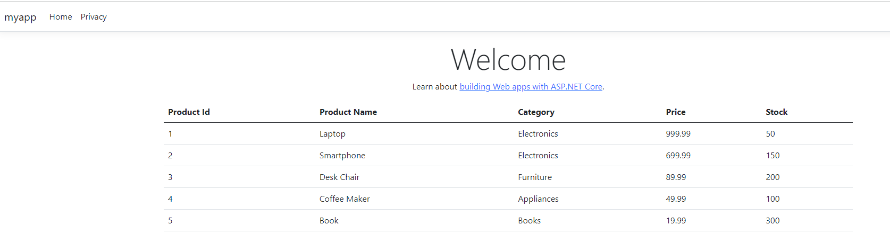

---
lab:
  title: 配置用于 Azure SQL 数据库的托管标识
  module: Explore Azure SQL Database safety practices for development
---

# 配置用于 Azure SQL 数据库的托管标识

在本练习中，你将向示例 Web 应用添加托管标识，而无需在代码中存储凭据。

Azure 应用服务提供了高度可扩展且可自我维护的 Web 托管解决方案。 其主要功能之一是为应用程序提供托管标识，从而简化对 Azure SQL 数据库和其他 Azure 服务的安全访问。 通过使用托管标识，无需在连接字符串中存储凭据等敏感信息，从而可增强应用的安全性。 

完成此练习大约需要 30 分钟。

## 准备工作

在开始本练习之前，需要：

- 包含创建和管理资源适当权限的 Azure 订阅。
- 在计算机上安装了 [SQL Server Management Studio (SSMS)](https://learn.microsoft.com/en-us/ssms/install/install)。****
- [**Visual Studio Code**](https://code.visualstudio.com/download?azure-portal=true) 已安装在你的计算机上，并安装了以下扩展：
    - [Azure 应用服务](https://marketplace.visualstudio.com/items?itemName=ms-azuretools.vscode-azureappservice?azure-portal=true)。

## 创建 Web 应用程序和 Azure SQL 数据库

首先，我们将创建 Web 应用程序和 Azure SQL 数据库。

1. 登录到 [Azure 门户](https://portal.azure.com?azure-portal=true)。
1. 搜索并选择“**订阅**”。
1. 导航到“**设置**”下的“**资源提供程序**”，搜索 **Microsoft.Sql** 提供程序，然后选择“**注册**”。
1. 返回 Azure 门户的主页，选择“**创建资源**”。
1. 搜索“Web 应用”**** 并选择它。
1. 选择“**创建**”并填写所需详细信息：

    | 组 | 设置 | 值 |
    | --- | --- | --- |
    | **项目详细信息** | **订阅** | 选择 Azure 订阅。 |
    | **项目详细信息** | **资源组** | 选择或创建新资源组 |
    | **实例详细信息** | **Name** | 输入 Web 应用的唯一名称 |
    | **实例详细信息** | **运行时堆栈** | .NET 8 (LTS) |
    | **实例详细信息** | **区域** | 选择要在其中托管 Web 应用的区域 |
    | **定价计划** | **定价计划** | 基本 |
    | **Database** | **引擎** | SQLAzure |
    | **Database** | 服务器名称 | 输入 SQL 服务器的唯一名称 |
    | **Database** | **数据库名称** | 输入数据库的唯一名称 |
    

    > **备注：** 对于生产工作负荷，选择“**标准 - 常规用途生产应用**”。 新数据库的用户名和密码是自动生成的。 要在部署后检索这些值，请转到位于应用的“**环境变量**”页上的“**连接字符串**”。 

1. 选择“查看 + 创建”，然后选择“创建”********。 部署可能需要几分钟时间才能完成。
1. 在 SSMS 中连接到数据库，并运行以下代码：

    >**提示**：可以通过在 Web 应用资源的“服务连接器”页中检查连接字符串，获取已分配给服务器的用户 ID 和密码
 
    ```sql
    CREATE TABLE Products (
        ProductID INT PRIMARY KEY,
        ProductName NVARCHAR(100),
        Category NVARCHAR(50),
        Price DECIMAL(10, 2),
        Stock INT
    );
    
    INSERT INTO Products (ProductID, ProductName, Category, Price, Stock) VALUES
    (1, 'Laptop', 'Electronics', 999.99, 50),
    (2, 'Smartphone', 'Electronics', 699.99, 150),
    (3, 'Desk Chair', 'Furniture', 89.99, 200),
    (4, 'Coffee Maker', 'Appliances', 49.99, 100),
    (5, 'Book', 'Books', 19.99, 300);
    ```

## 将帐户添加为 SQL 管理员

接下来，将帐户访问权限添加到数据库。 这是必需操作，因为只有通过 Microsoft Entra 进行验证的帐户才能创建其他 Microsoft Entra ID 用户，这是本练习中后续步骤的先决条件。

1. 导航到之前创建的 Azure SQL Server。
1. 在“**设置**”左侧菜单中选择 **Microsoft Entra ID**。
1. 选择“设置管理员”。
1. 搜索你的帐户并选中。
1. 选择“保存”。

## 启用托管标识

接下来，将为 Azure Web 应用启用系统分配的托管标识，这是一种允许自动进行凭据管理的安全最佳做法。

1. 在 Azure 门户中导航到 Web 应用。
1. 在左侧菜单的“**设置**”中，选择“**标识**”。
1. 在“**系统分配**”选项卡下，将“**状态**”切换为“**打开**”并选择“**保存**”。 如果收到一条消息，询问是否要为 Web 应用启用系统分配的托管标识，请选择“**是**”。

## 授予对 Azure SQL 数据库的访问权限

1. 使用 SSMS 再次连接到 Azure SQL 数据库。 选择“Microsoft Entra MFA”**** 并提供用户名。
1. 选择数据库，然后打开新的查询编辑器。
1. 执行以下 SQL 命令，为托管标识创建用户并分配必要的权限。 通过提供 Web 应用名称来编辑脚本。

    ```sql
    CREATE USER [your-web-app-name] FROM EXTERNAL PROVIDER;
    ALTER ROLE db_datareader ADD MEMBER [your-web-app-name];
    ALTER ROLE db_datawriter ADD MEMBER [your-web-app-name];
    ```

## 创建  Web 应用程序

接下来，你将创建一个 ASP.NET 应用程序，该应用程序使用 Entity Framework Core 和 Azure SQL 数据库显示产品表中的产品列表。

### 创建项目

1. 在 VS Code 上，创建一个新文件夹。 将该文件夹命名为你的项目名称。
1. 打开终端并运行以下命令以创建新的 MVC 项目。
    
    ```dos
   dotnet new mvc
    ```
    这将在所选文件夹中创建新的 ASP.NET MVC 项目，并将其加载到 Visual Studio Code 中。

1. 运行以下命令来执行应用程序。 

    ```dos
   dotnet run
    ```
1. 现在侦听的*终端输出：<port>http://localhost:*。 导航到 Web 浏览器中的 URL 来访问应用程序。 

1. 关闭 Web 浏览器并停止应用程序。 或者，可以通过在 VS Code 终端中按 `Ctrl+C` 停止应用程序。

### 更新项目以连接到 Azure SQL 数据库

接下来，你将更新一些配置，以便使用托管标识成功连接到 Azure SQL 数据库。

1. 在项目中，为 SQL Server 添加必要的 NuGet 包。
    ```dos
    dotnet add package Microsoft.EntityFrameworkCore.SqlServer
    ```
1. 在项目的根文件夹中，打开 **appsettings.json** 文件并插入 `ConnectionStrings` 节。 在这里，你将用实际的服务器和数据库名称替换 `<server-name>` 和 `<db-name>`。 `Models/MyDbContext.cs` 文件中的默认构造函数使用此连接字符串来建立与数据库的连接。

    ```json
    {
      "Logging": {
        "LogLevel": {
          "Default": "Information",
          "Microsoft.AspNetCore": "Warning"
        }
      },
      "AllowedHosts": "*",
      "ConnectionStrings": {
        "DefaultConnection": "Server=<server-name>.database.windows.net,1433;Initial Catalog=<db-name>;Authentication=Active Directory Default;"
      }
    }
    ```
1. 保存并关闭该文件。

### 添加代码

1. 在项目的 **Models** 文件夹中，使用以下代码为产品实体创建 **Product.cs** 文件。 将 `<app name>` 替换为应用程序的实际名称。

    ```csharp
    namespace <app name>.Models;
    
    public class Product
    {
        public int ProductId { get; set; }
        public string ProductName { get; set; }
        public string Category { get; set; }
        public decimal Price { get; set; }
        public int Stock { get; set; }
    }
    ```
1. 在项目的根文件夹上创建文件夹 **Database**。
1. 在项目的 **Database** 文件夹中，使用以下代码为产品实体创建 **MyDbContext.cs** 文件。 将 `<app name>` 替换为应用程序的实际名称。

    ```csharp
    using <app name>.Models;
    
    namespace <app name>.Database;
    
    using Microsoft.EntityFrameworkCore;
    
    public class MyDbContext : DbContext
    {
        public MyDbContext(DbContextOptions<MyDbContext> options) : base(options)
        {
        }
    
        public DbSet<Product> Products { get; set; }
    }    
    ```
1. 在项目的 **Controllers** 文件夹中，编辑 **HomeController.cs** 文件的类 `HomeController` 和 `IActionResult`，并使用以下代码添加 `_context` 变量。

    ```csharp
    private MyDbContext _context;

    public HomeController(ILogger<HomeController> logger, MyDbContext context)
    {
        _logger = logger;
        _context = context;
    }

    public IActionResult Index()
    {
        var data = _context.Products.ToList();
        return View(data);
    }
    ```

1. 此外，请将 `using.<app name>.Database` 添加到文件顶部。
1. 在项目的“**视图 -> 主页**”文件夹中，更新 **Index.cshtml** 文件，并添加以下代码。

    ```html
    <table class="table">
        <thead>
            <tr>
                <th>Product Id</th>
                <th>Product Name</th>
                <th>Category</th>
                <th>Price</th>
                <th>Stock</th>
            </tr>
        </thead>
        <tbody>
            @foreach(var item in Model)
            {
                <tr>
                    <td>@item.ProductId</td>
                    <td>@item.ProductName</td>
                    <td>@item.Category</td>
                    <td>@item.Price</td>
                    <td>@item.Stock</td>
                </tr>
            }
        </tbody>
    </table>
    ```

1. 编辑 **Program.cs** 文件，并在 `var app = builder.Build();` 行上方插入所提供的代码片段。 此更改可确保代码在应用程序的启动序列中执行。 将 `<app name>` 替换为应用程序的实际名称。

    ```csharp
    using Microsoft.EntityFrameworkCore;
    using <app name>.Database;

    var builder = WebApplication.CreateBuilder(args);

    // Add services to the container.
    builder.Services.AddControllersWithViews();
    builder.Services.AddDbContext<MyDbContext>(options =>
        options.UseSqlServer(builder.Configuration.GetConnectionString("DefaultConnection")));
    ```

    > **备注：** 如果要在部署之前运行应用程序，请使用 SQL 用户凭据更新连接字符串。 新数据库的用户名和密码是自动生成的。 要在部署后检索这些值，请转到位于应用的“**环境变量**”页上的“**连接字符串**”。 确认应用程序按预期运行后，请切换回使用托管标识进行安全部署过程。

### 部署你的代码

1. 按 `Ctrl+Shift+P` 打开**命令面板**。
1. 键入 **Azure 应用服务: 部署到 Web 应用...** 并将其选中。
1. 选择包含 Web 应用程序代码的文件夹。
1. 选择上一步中创建的 Web 应用。
    > 备注：你可能会收到一条消息：“你的应用缺少部署所需的配置”。 选择“**添加配置**”。然后按照说明操作，选择订阅和应用服务资源。
1. 出现提示时，确认部署。

## 测试应用程序

运行 Web 应用程序，并验证它是否可以在没有任何存储凭据的情况下连接到 Azure SQL 数据库。

1. 打开浏览器并导航到 Azure Web 应用的 URL（例如 https://your-web-app-name.azurewebsites.net)）。
1. 验证 Web 应用程序是否正在运行并可访问。
1. 你应该能看到如下所示的网页。

    

## 设置持续部署（可选）

1. 按 `Ctrl+Shift+P` 打开**命令面板**。
1. 键入 **Azure App 服务: 配置持续交付...** 并将其选中。
1. 按照提示从 GitHub 存储库或 Azure DevOps 设置持续部署。

考虑使用**用户分配的托管标识**而不是**系统分配的托管标识**会更有利的情况。

## 清理

在自己的订阅中操作时，最好在项目结束时确定是否仍需要已创建的资源。 

让资源不必要地运行可能会导致额外费用。 可以在 [Azure 门户](https://portal.azure.com?azure-portal=true)中单独删除资源或删除整套资源。

## 详细信息

有关 Azure SQL 数据库自动故障转移组的详细信息，请参阅 [Microsoft Entra 中用于 Azure SQL 的托管标识](https://learn.microsoft.com/azure/azure-sql/database/authentication-azure-ad-user-assigned-managed-identity?azure-portal=true)。
